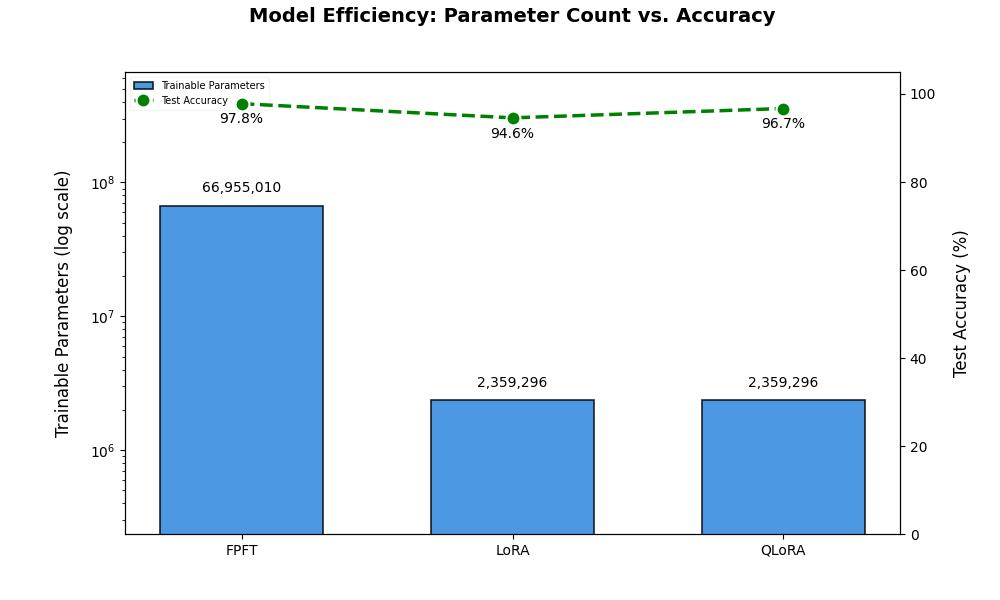

# BERT-Spam-Classifier
Implementation and comparison of 3 fine-tuning approaches , with FPFT and LoRA implemented from scratch and QLoRA utilizing the PEFT library.
It demonstrates the effectiveness of parameter-efficient methods in comparision to FPFT , showcasing significant parameter reduction while maintaining competitive performance.
Base Model : DistilBERT-uncased , trained on UCI SMS Spam Collection dataset

| Method | Parameters | Accuracy | Notes |
|--------|------------|----------|-------|
| FPFT | 66M (100%) | 97.8% | Baseline performance |
| LoRA | 2.3M (3.48%) | 94.6% | -3.2% accuracy with 96.52% parameter reduction |
| QLoRA | 2.3M (3.48%) | 96.7% | -1.1% accuracy, 4-bit quantization |

QLoRA nearly matches FPFT performance with additional memory benefits through Quantization.

